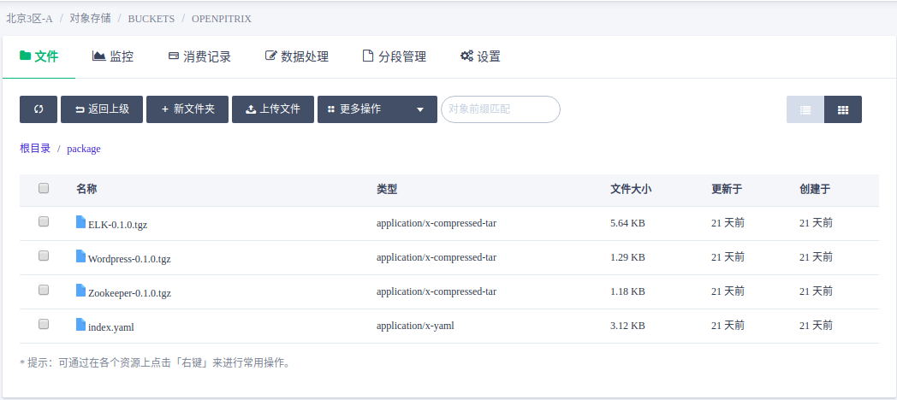
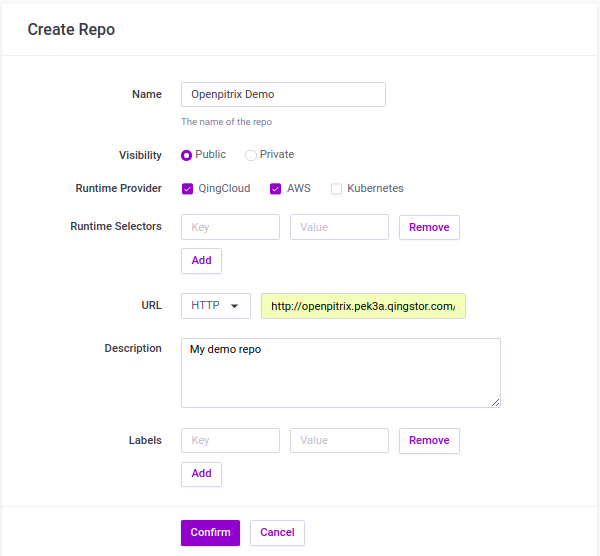
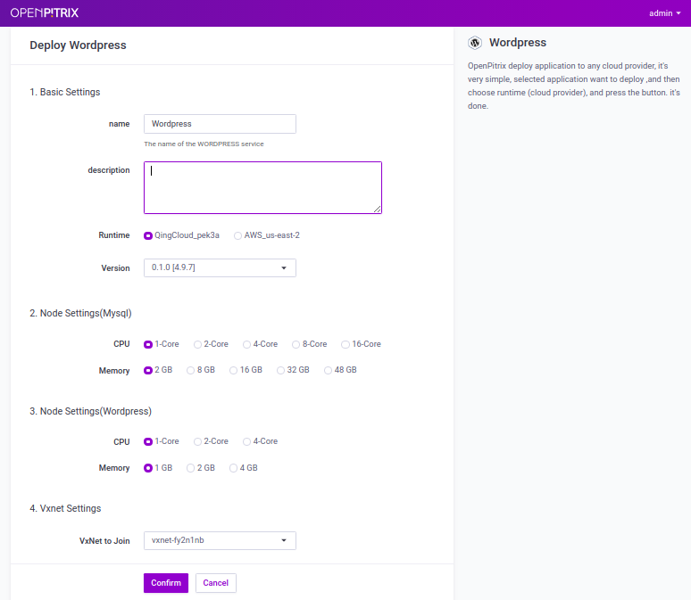
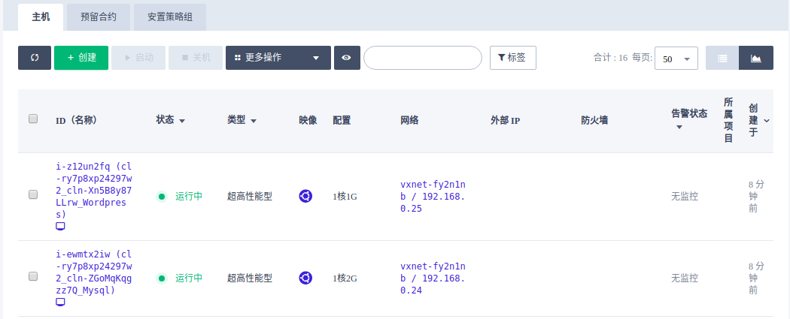

Deploy WordPress on QingCloud
==

## Create Repo
Log in to [OpenPitrix](https://lab.openpitrix.io) in the **developer** role, go to **Repo** TAB, and click the **Create** button on the right.

URL write [http://openpitrix.pek3a.qingstor.com/package/]() ，This is just a demo repo and the details are as follows:

The **Runtime Provider** can be selected, but **Kubernetes** is different from other vm-based environment application configuration package formats. **QingCloud** and **AWS** can be selected at the same time, which means the application in the current **Repo** can be deployed to **QingCloud** or **AWS**.

After the **Repo** is created, you can find that the application has been imported automatically. If the application in the **Reppo** has been updated, it can be updated by **Trigger indexer** in operation

## Create Runtime

Log in to [OpenPitrix](https://lab.openpitrix.io) as a normal user, enter **Runtime** Tab, and click the **Create** button on the right.

* The **Runtime Provider** select **QingCloud**
* **URL** input QingCloud public cloud API server address: [ https://api.qingcloud.com]()
* **Access Key ID** and **Secret Access Key** in completing **QingCloud platform** [API secret key](https://console.qingcloud.com/access_keys/) that is generated
* After filling in the correct URL and API key information, **Zone** can select from the drop-down list

## App deployment

### 1. Prepare QingCloud platform environment

* Create [VPC](https://console.qingcloud.com/pek3a/routers/)
* Create a private network and connected to the VPC
* Create a [public network IP](https://console.qingcloud.com/pek3a/eips/)
* Public network IP binding to VPC

### 2. Prepare app
Find the Wordpress application through **App** TAB, or go to the details page of the newly created repository to find the Wordpress application through **Repo** TAB

### 3. Deploy app
Click **Deploy** button to go to the deployment detail page, select **the required resources** and the newly created QingCloud **Runtime**, then select application **Versions** and **private network**, finally click **Confirm** button.

### 4. View deployment status
You can view the application instance you just deployed in the operations center, including a Wordpress cluster and a frontgate cluster, and the creation is successful when the cluster status is shown as active.

> Frontgate is responsible for metadata storage and functions such as communication between the OpenPitrix framework and the application instance host

### 5. View Wordpress
The host status and IP can be viewed from [QingCloud Console](https://console.qingcloud.com/pek3a/instances/)

You can enter the network environment where VPC is located through VPN, or you can access the Wordpress home page by forwarding and then accessing the public network IP + forwarding port bound by VPC through the VPC configuration port.
